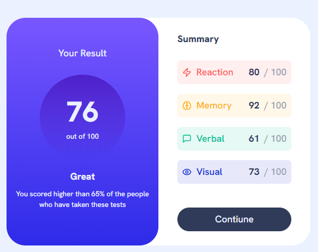

# Results Summary Component

A modern and responsive results summary dashboard built with React, TypeScript, and Tailwind CSS. This project features a clean UI design for displaying test results with interactive elements and smooth transitions.



##Live Demo

Check out the [Live Demo](https://terrysu418.github.io/Fontend-Mentor-results-summary-component-main/)

## Features
- Interactive score cards with hover effects
- Responsive design for all screen sizes
- Gradient backgrounds and modern UI
- Color-coded categories for better readability
- Smooth transitions on interactive elements

## Technologies Used
- React 
- TypeScript
- Tailwind CSS
- Lucide React Icons
- Vite

## Installation
1. Clone the repository:
```bash
git clone https://github.com/TerrySu418/Fontend-Mentor-results-summary-component-main.git